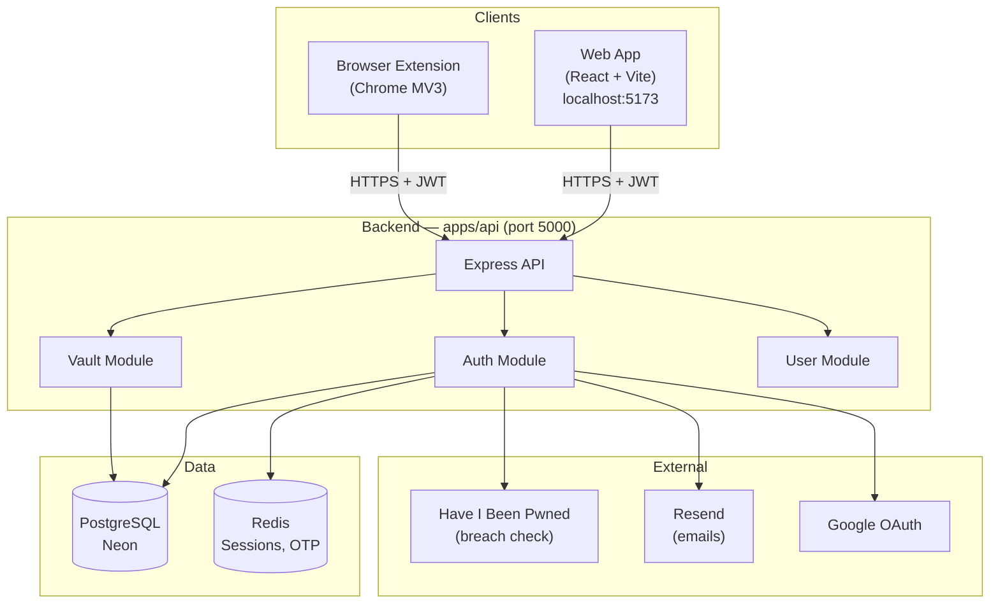
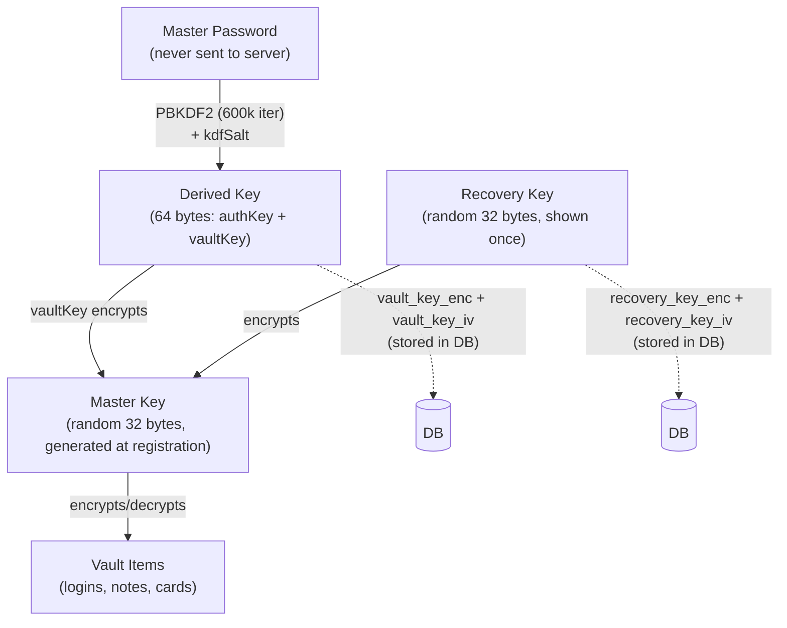
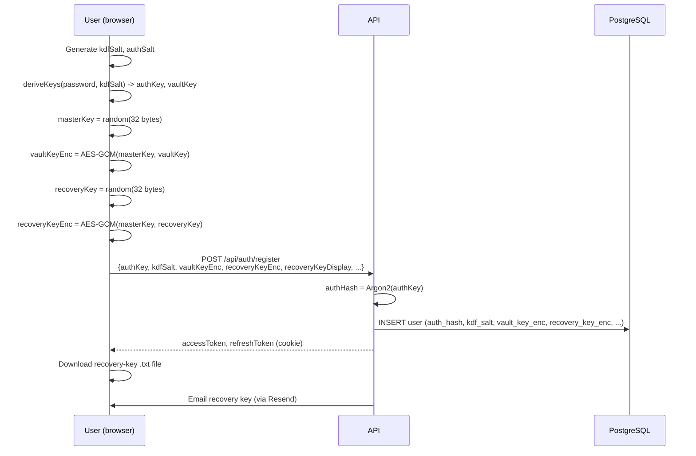
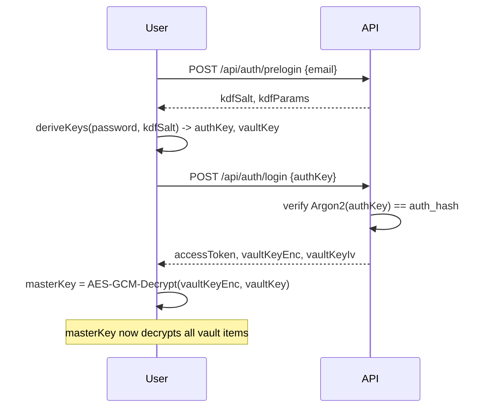
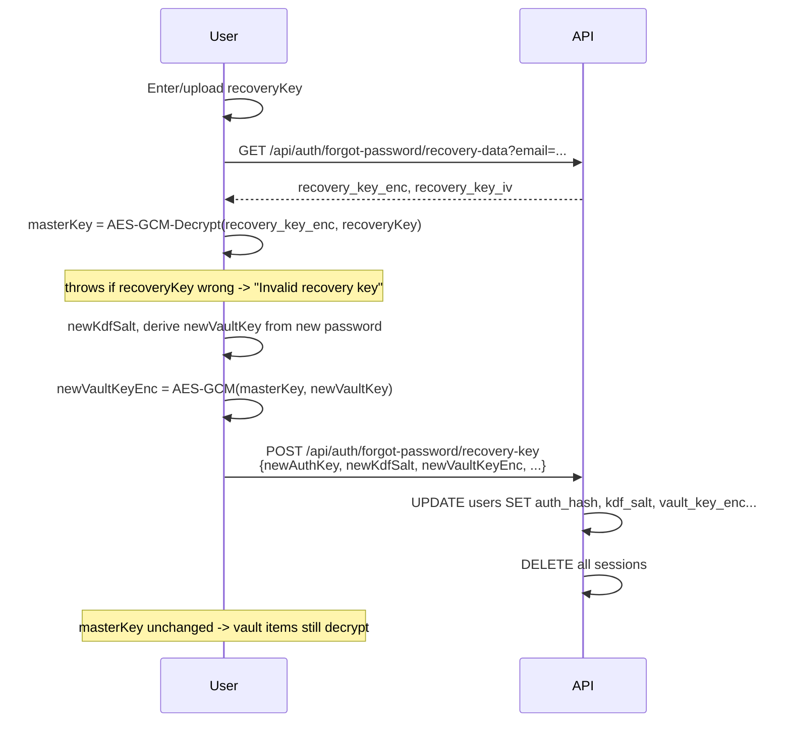

# VaultX — Zero-Knowledge Password Manager

VaultX is a full-stack password manager built around a zero-knowledge
architecture: the server never sees your master password or any unencrypted
vault data. All encryption and decryption happens in the browser using the
Web Crypto API.

This is a monorepo containing three applications:

| App               | Path              | Stack                                                  |
| ----------------- | ----------------- | ------------------------------------------------------ |
| API               | `apps/api`        | Node.js, Express, TypeScript, PostgreSQL (Neon), Redis |
| Web App           | `apps/web`        | React 18, TypeScript, Vite, Tailwind                   |
| Browser Extension | `apps/extensions` | React, TypeScript, Vite, Chrome MV3                    |

Each app has its own detailed README — see:

- [`apps/api/README.md`](apps/api/README.md)
- [`apps/web/README.md`](apps/web/README.md)
- [`apps/extensions/README.md`](apps/extensions/README.md)

---

## 1. High-Level Architecture



**Key principle**: the API stores only _encrypted blobs_ for vault data
(`encrypted_data`, `iv`) and _encrypted keys_ (`vault_key_enc`,
`recovery_key_enc`). It has no way to read passwords, notes, or card details —
even with full database access.

---

## 2. The Zero-Knowledge Key Hierarchy

This is the most important concept in the codebase. Three keys exist, each
derived/encrypted differently:



- **Master Key** is the _root secret_. It's generated once at registration and
  encrypts every vault item directly. It never changes unless an OTP-based
  reset occurs.
- **Master Password** never leaves the device. `PBKDF2(password, kdfSalt,
600000 iterations)` produces 64 bytes, split into `authKey` (sent to server,
  hashed again with Argon2, used for login verification) and `vaultKey` (stays
  client-side, decrypts `vault_key_enc` to reveal the Master Key).
- **Recovery Key** is a second, independent "lock" on the Master Key. It's
  shown once at registration (downloadable `.txt` + emailed) and lets a user
  reset their password **without losing vault data** — see the reset flows
  below.

### Why AES-GCM doubles as verification

AES-GCM includes an authentication tag. If you try to decrypt
`recovery_key_enc` with the wrong recovery key, `subtle.decrypt()` throws —
there's no separate "is this key correct" check needed. Wrong key = throw =
caught and shown as "Invalid recovery key".

---

## 3. Authentication & Reset Flows

### Registration



### Login



### Forgot Password — Recovery Key (vault preserved)



### Forgot Password — Email OTP (vault cleared)

Same shape, but `masterKey` is **regenerated** (new random 32 bytes) instead
of recovered. Old vault items, encrypted with the old masterKey, become
permanently unreadable — by design (zero-knowledge means the server can't
"migrate" them without the old key).

---

## 4. Monorepo Structure

```
pm/
├── apps/
│   ├── api/                  # Express backend
│   │   ├── src/
│   │   │   ├── modules/
│   │   │   │   ├── auth/      # register, login, OAuth, password reset
│   │   │   │   ├── vault/      # vault items CRUD, sharing
│   │   │   │   ├── user/       # profile
│   │   │   │   └── share/      # one-time share links
│   │   │   ├── db/
│   │   │   │   ├── migrations/ # Knex migrations
│   │   │   │   ├── pool.ts      # PostgreSQL pool
│   │   │   │   └── redis.ts
│   │   │   ├── middleware/      # auth, rate limiting, HIBP check
│   │   │   ├── utils/            # jwt, hash, mailer, emailTemplates
│   │   │   └── index.ts
│   │   └── README.md
│   │
│   ├── web/                   # React web app
│   │   ├── src/
│   │   │   ├── pages/           # Login, Register, Dashboard, Settings, etc.
│   │   │   ├── components/       # VaultItemCard, modals
│   │   │   ├── lib/                # crypto.ts, kdf.ts, api.ts, storage.ts
│   │   │   └── store/              # Zustand state (useVaultStore)
│   │   └── README.md
│   │
│   └── extensions/             # Chrome/Edge extension (MV3)
│       ├── src/
│       │   ├── background/        # service-worker.ts (message router)
│       │   ├── content/             # content-script.ts (form capture/autofill)
│       │   ├── popup/                # Login, Vault, VaultItem, CardPinGate
│       │   └── lib/                   # crypto, kdf, api, message
│       └── README.md
│
├── README.md
└── CONTRIBUTING.md
```

---

## 5. Tech Stack Summary

| Layer                 | Choice                          | Why                                                           |
| --------------------- | ------------------------------- | ------------------------------------------------------------- |
| Backend framework     | Express + TypeScript            | Simple, well-understood, fast to iterate                      |
| Database              | PostgreSQL (Neon)               | Serverless Postgres, branching, generous free tier            |
| Cache/sessions        | Redis                           | Session storage, OTP codes, rate-limit counters               |
| Auth tokens           | JWT (access + refresh)          | Stateless access tokens, rotated refresh tokens in DB         |
| Password hashing      | Argon2id                        | Server-side hash of client-derived authKey (defense-in-depth) |
| Client key derivation | PBKDF2-SHA256, 600k iterations  | Web Crypto native, no WASM dependency                         |
| Encryption            | AES-256-GCM                     | Authenticated encryption, built into Web Crypto               |
| Frontend              | React 18 + Vite + Tailwind      | Fast dev loop, small bundle                                   |
| Extension             | Chrome MV3 (service worker)     | Required for current Chrome Web Store submissions             |
| Email                 | Resend                          | Simple API, good deliverability                               |
| Breach checking       | Have I Been Pwned (k-anonymity) | Passwords never leave the device                              |

---

## 6. Local Development Quick Start

```bash
# 1. Install dependencies (run from repo root — npm workspaces)
npm install

# 2. Set up environment variables (see each app's README for required vars)
cp apps/api/.env.example apps/api/.env
cp apps/web/.env.example apps/web/.env

# 3. Run migrations
cd apps/api && npm run migrate

# 4. Start everything (3 terminals)
cd apps/api && npm run dev      # http://localhost:5000
cd apps/web && npm run dev      # http://localhost:5173
cd apps/extensions && npm run dev  # then load dist/ as unpacked extension
```

---

## 7. Security Notes

- **Zero-knowledge**: server stores only ciphertext + encrypted keys. Master
  password and Master Key never transit the network.
- **Defense in depth**: client sends `authKey` (derived via PBKDF2), server
  hashes it again with Argon2id before storing — so even a DB leak doesn't
  expose anything usable for offline cracking of the original password.
- **Session security**: refresh tokens are rotated on every use; reuse of an
  old refresh token triggers a "kill all sessions" response (token-theft
  protection).
- **Rate limiting**: login, registration, and refresh endpoints are rate
  limited.
- **HIBP checks**: passwords are checked against Have I Been Pwned using
  k-anonymity (only first 5 chars of SHA-1 hash sent).
