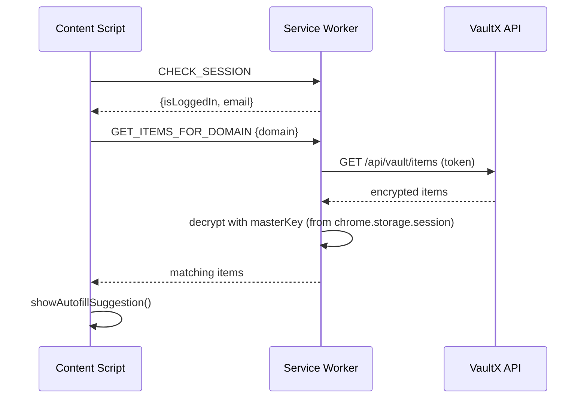

# VaultX Browser Extension

Chrome/Edge Manifest V3 extension. Provides vault access, autofill, and
automatic credential capture across the web.

## Stack

- React + TypeScript + Vite (`@crxjs/vite-plugin` or similar MV3 build setup)
- Chrome Extension APIs: `storage`, `runtime`, `alarms`, `identity` (web), `tabs`

## Project Structure

```
src/
├── background/
│   └── service-worker.ts     # central message router + session management
├── content/
│   └── content-script.ts      # runs on every page (except excluded domains)
├── popup/
│   ├── App.tsx                 # session-check root: loading/login/vault/reunlock
│   ├── pages/
│   │   ├── Login.tsx             # email + master password only
│   │   └── Vault.tsx              # item list, search, filters, pending banner
│   └── components/
│       ├── VaultItem.tsx           # login/note/card row, expand/collapse
│       └── CardPinGate.tsx          # PIN entry for card items
└── lib/
├── crypto.ts          # identical algorithm to web app
├── kdf.ts
├── api.ts               # fetch wrapper, auto-refresh on 401
└── messages.ts           # MSG constants + request/response types
```

## Message Architecture

All popup ↔ background ↔ content-script communication goes through
`chrome.runtime.sendMessage` with typed messages defined in `lib/messages.ts`.
The service worker's `handleMessage` switch is the single entry point —
**every new feature needs a new `MSG` constant + case + handler function.**



## Session Storage Model

| Storage                  | Contents                                   | Lifetime                            |
| ------------------------ | ------------------------------------------ | ----------------------------------- |
| `chrome.storage.session` | `{ masterKey, email }`                     | In-memory, cleared on browser close |
| `chrome.storage.local`   | `{ accessToken, email }` (`persistedAuth`) | Survives browser restart            |

On browser restart: `accessToken` persists but `masterKey` is gone →
`CHECK_SESSION` returns `needsUnlock: true` → popup shows **re-unlock screen**
(email shown, master password re-entry → `REUNLOCK` message → re-derives
masterKey via fresh `/api/auth/prelogin` + `/api/user/profile`, no full
re-login needed).

## Content Script Behavior

Runs on every page except `EXCLUDED_DOMAINS` (`localhost`, password-manager
sites). Two independent features:

### 1. Credential Capture (on form submit)

- Captures all visible filled inputs, maps field names to vault schema keys
  (`mapFieldToVaultKey`).
- Waits 1.2s, then checks: did the page navigate OR did the password field
  change/disappear? If the form is **unchanged** (same URL, same password
  value) → assumes failed login → does NOT save.
- If logged in + auto-save ON → saves silently, shows toast.
- If auto-save OFF → shows a save banner ("Save to VaultX" / "Not now"); "Not
  now" stores a **pending credential** (10-minute expiry) retrievable from the
  popup.

### 2. Autofill Suggestion (on page load)

- If a password field exists, user is logged in, and saved items match the
  current domain → shows a small "🔐 VaultX — Autofill available" box.
- Clicking an entry calls `autofillCredentials()`, which fills matching
  inputs via `mapFieldToVaultKey`.

## Card PIN

Cards require a separate 4-8 digit PIN (bcrypt-hashed server-side,
independent of the master password). `CardPinGate.tsx` handles
set/verify/re-lock (5-minute auto-relock via `chrome.storage.session`).
Forgot PIN → reset via web app Settings (OTP-verified).

## Environment / Build-time Config

`vite-env.d.ts` declares `__GOOGLE_CLIENT_ID__` (currently unused after Google
login was removed from the extension — kept for potential future use, safe to
remove if unused).

`lib/api.ts` — `API_BASE` is currently hardcoded to `http://localhost:5000`.
**Must be changed to the production API URL before publishing** (see root
README deployment checklist).

## Building & Loading

```bash
npm run dev      # dev build with watch
npm run build    # production build -> dist/
```

To load locally:

1. `chrome://extensions`
2. Enable "Developer mode"
3. "Load unpacked" → select `apps/extensions/dist`

## Known Limitations

- Capture/autofill works best on traditional (non-SPA) login forms. SPAs that
  navigate via `pushState` without a full reload won't re-trigger the
  autofill-suggestion check on route change.
- Not yet published to Chrome Web Store / Edge Add-ons — distribution is
  currently "Load unpacked" only.
